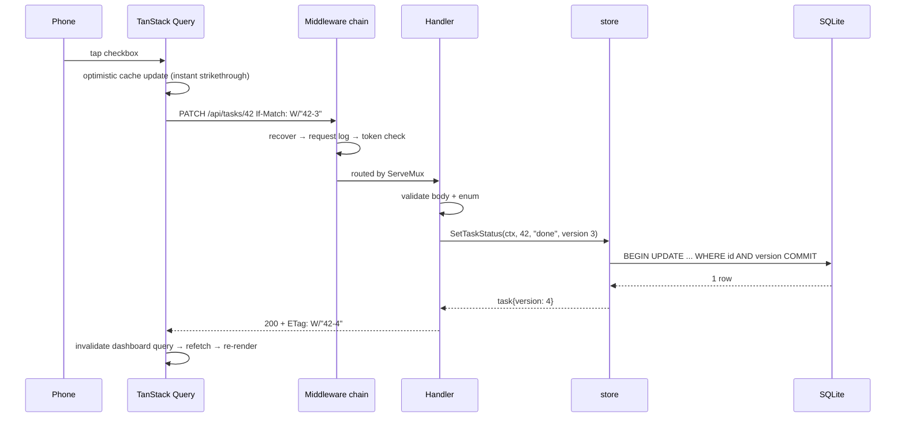

# Architecture

Single-user productivity dashboard. One Go binary with an embedded React frontend, a SQLite
file, reached from a laptop and a phone over Tailscale.

**Companion documents:** [DATABASE.md](DATABASE.md) (schema, the source of `001_init.sql`) ·
[API.md](API.md) (endpoint contract) · [adr/](adr/) (why each choice was made).

---

## 1. Components

```
┌─ phone / laptop (Tailscale) ───────────────────┐
│  http://<tailnet-name>:8484                    │
│  PWA, installable, no service worker           │
└────────────────────────┬───────────────────────┘
                         │ JSON over HTTP (X-Token optional)
┌────────────────────────▼───────────────────────┐
│  one Go binary  (CGO_ENABLED=0)                │
│                                                │
│  cmd/server        flags, wiring, lifecycle    │
│  internal/log      slog handler selection      │
│  internal/api      middleware chain + handlers │
│  internal/plan     pure functions: week, streak│
│  internal/store    SQLite: migrations + CRUD   │
│  internal/seed     seed.json + additive loader │
│  internal/web      go:embed web/dist           │
│  internal/backup   nightly VACUUM INTO ticker  │
└────────────────────────┬───────────────────────┘
                         │
              ~/dashboard-data/dashboard.db  (WAL)
              ~/dashboard-data/backups/      (14 kept)
              ~/dashboard-data/logs/
```

### Responsibilities

| Component | Owns | Must not |
|---|---|---|
| `cmd/server` | Flag parsing, dependency wiring, HTTP server lifecycle, graceful shutdown. Fails fast and exits non-zero if migrations, seeding, or the DB open fail. | Contain business logic. |
| `internal/log` | Building the `*slog.Logger` — text handler when `-log-format=text`, JSON when `json`. | Be imported by `store` or `plan` (ADR-004: no logging below the API layer). |
| `internal/api` | Transport only: decode, validate, call one or more store methods, encode, map errors to status codes. Owns the middleware chain and is the **only** place errors are logged. | Contain SQL, or reach into `database/sql`. |
| `internal/plan` | Pure functions with no I/O: plan-week resolution, streak calculation, week-completion percentage. Fully unit-testable. | Touch the DB, the clock, or the logger — `now` and the week list are passed in. |
| `internal/store` | Opening SQLite, applying migrations, typed CRUD, transactions, optimistic-version checks. Returns wrapped errors and sentinels. | Log. Format anything for HTTP. |
| `internal/seed` | Holding `seed.json`, and the additive-upsert loader that runs at boot. | Update or delete existing rows. |
| `internal/web` | `go:embed web/dist` and the SPA fallback handler. | Know anything about the API. |
| `internal/backup` | Nightly `VACUUM INTO` ticker and prune-to-14. | Kill the server when a backup fails. |

`cmd/seedgen` is a separate build-time tool: it parses `master-plan-v5.md` into
`internal/seed/seed.json`. It is **not** part of the server binary — the server only ever reads
the committed JSON.

---

## 2. Layering

Two layers, deliberately (ADR-004):

```
HTTP request → middleware chain → handler → store method → SQLite
                                     ↓
                              internal/plan (pure)
```

There is no service layer, no repository interface, no store decorators. The rules that keep
this honest:

1. **Handlers are transport only.** No SQL, no business rules beyond validation.
2. **The store is persistence only.** No HTTP concepts, no logging.
3. **Derived values are pure functions.** Plan week, streak, and completion % take their inputs
   as arguments and return values — no clock, no DB, no logger.
4. **Errors are logged exactly once**, in the API layer's respond-error helper. Everything
   below wraps with `%w` and returns.

If per-operation telemetry or a second backend is ever needed, extract a store interface then
and wrap it. That is a mechanical retrofit, not a redesign.

---

## 3. Request flow

Checking off a task, end to end:



Failure paths:

- **Version mismatch** → store returns `ErrConflict` → handler responds `412` with the current
  resource → client replaces its cache with server truth and shows a "refreshed" toast.
- **Any other error** → rolled back optimistically, error envelope rendered as a toast.
- **Every write is one HTTP call and one SQLite transaction.** There is no local-only state
  that can be lost, which is what makes `kill -9` a non-event.

---

## 4. Stack

| Choice | One-line rationale |
|---|---|
| Go | Single static binary, stdlib HTTP is enough, and it's the language the surrounding portfolio is in. |
| `modernc.org/sqlite` | Pure Go — `CGO_ENABLED=0` cross-compiles to a home server later without a toolchain (ADR-001). |
| SQLite, WAL, `busy_timeout=5000` | One user, one writer; zero operations; backup is a file (ADR-001). |
| stdlib `net/http` ServeMux | Go 1.22+ handles `GET /api/tasks/{id}` and `PathValue`; 12 endpoints don't justify a dependency (ADR-005). |
| `log/slog` | Structured logging in the stdlib; text for humans in dev, JSON under launchd (ADR-006). |
| React 18 + TypeScript + Vite | Fast builds, typed API client, and the ecosystem for drag-and-drop and server state. |
| Tailwind v4 | CSS-first config; the dark palette is a handful of `@theme` tokens, no JS config file. |
| TanStack Query | Server state, cache invalidation, and optimistic mutations with rollback — the exact shape of this app's interactions. |
| dnd-kit | Kanban drag on desktop; mobile uses an explicit tap-to-move menu instead. |
| wouter | Four routes. A full router would be the largest frontend dependency for the least benefit. |
| `go:embed` | One artifact to copy and run; no Node at runtime (ADR-002). |
| Tailscale ACL + optional `X-Token` | The network is the perimeter; no accounts to build or secure (ADR-003). |

---

## 5. Runtime and operations

- **Binding:** `-addr 100.x.y.z:8484`, the Tailscale IP. Never `0.0.0.0` — the tailnet ACL is
  the authentication (ADR-003).
- **Process:** a launchd agent with `KeepAlive`, started at login. macOS, so no systemd.
- **Startup failure** (migration error, locked DB, unparseable seed): log at `ERROR` with the
  wrapped cause and exit non-zero. No degraded mode — a half-started app serving 500s is worse
  than one plainly down, because you would trust data that isn't there.
- **Backups:** nightly `VACUUM INTO backups/dashboard-YYYYMMDD.db`, newest 14 kept. `VACUUM
  INTO` is atomic; a plain file copy of a WAL database can be inconsistent.
- **Export:** `GET /api/export` returns every table as JSON on demand. Restore is a future
  concern; the `.db` snapshot and the JSON are the insurance.
- **State lives only in the database file.** The binary is stateless and replaceable.

---

## 6. Time

One rule, because getting it wrong corrupts the streak — the app's main feedback signal.

- **Stored** as RFC3339 **UTC** (`2026-08-22T14:03:00Z`).
- **Interpreted** in a fixed IANA zone, `Europe/Lisbon`, overridable with `-tz`.
- Every day boundary — streaks, Log-feed grouping, "today", the daily-review key — is computed
  in that zone. A log written at 00:30 local belongs to the day you were awake for, not to the
  previous UTC day.
