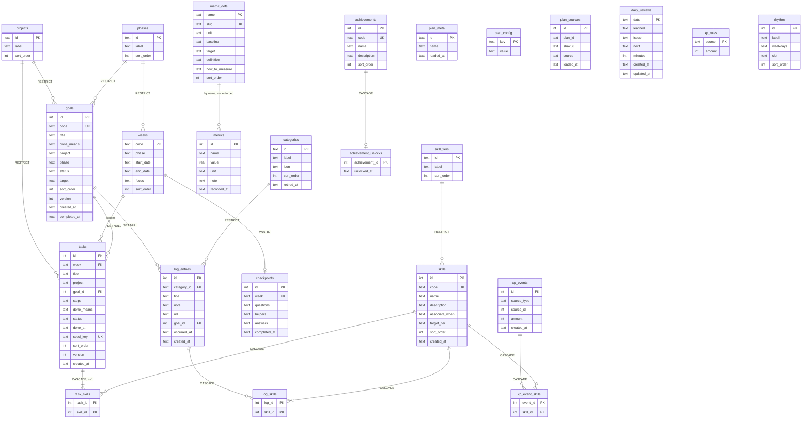

# Database design

SQLite, one file at `~/dashboard-data/dashboard.db`. **This document is the schema source of
truth.** Schema changes start here, then become a migration — never the other way round.

> **Table count delta.** `dashboard-plan-v2.md` describes six tables. The current design has
> plan identity/config tables, plan vocabulary tables, seeded reference tables, user-state
> tables, gamification tables, and `schema_migrations`. `weeks`, `rhythm`, `categories`,
> `metric_defs`, `checkpoints`, `projects`, `phases`, `skill_tiers`, and `skills` are all
> loaded from the plan rather than compiled into the app.

> **Scope boundary.** This schema covers the v1 tracker through M12 phone pairing, including M9 gamification.

---

## 1. Conventions

| Convention | Rule |
|---|---|
| Primary keys | `INTEGER PRIMARY KEY` (rowid alias) except where a natural key is genuinely stable: `plan_meta.id`, `plan_config.key`, `projects.id`, `phases.id`, `skill_tiers.id`, `categories.id`, `metric_defs.name`, `daily_reviews.date`, `xp_rules.source`. |
| Human codes | Plan-authored goal codes live in `goals.code`. They are **labels, not identity** — renumbering a plan must never break a foreign key. |
| Timestamps | `TEXT`, RFC3339 UTC with a `Z` suffix: `2026-08-22T14:03:00Z`. Sorts correctly as a string, readable in any SQLite browser, marshals directly from Go's `time.Time`. |
| Dates | `TEXT`, `YYYY-MM-DD`. Always a **`Europe/Lisbon`** calendar date, not a UTC one. |
| Booleans | Not used. States are `TEXT` enums with `CHECK` constraints, so the value is self-describing in a raw query. |
| JSON columns | `TEXT` holding a JSON array. Used only for ordered lists that are always read and written whole (`tasks.steps`, `checkpoints.questions`, `checkpoints.helpers`, `checkpoints.answers`). Never queried into. |
| Optimistic locking | `goals` and `tasks` carry `version INTEGER NOT NULL DEFAULT 1`, incremented on every successful update. See §6. |
| PRAGMAs at open | `journal_mode=WAL`, `busy_timeout=5000`, `foreign_keys=ON`, `synchronous=NORMAL`. |

`foreign_keys=ON` must be set on **every** connection — SQLite defaults it off, and the
`ON DELETE SET NULL` rules below are silently inert without it.

---

## 2. ERD

---

## 3. Enumerations And Plan Vocabulary

Only the app's own workflow states are compiled enums. Plan-specific words live in reference
tables and are changed by loading a different plan document.

| Enum | Values | Used by |
|---|---|---|
| `goal_status` | `backlog` · `active` · `done` | `goals.status` |
| `task_status` | `todo` · `done` | `tasks.status` |

| Reference table | Used by |
|---|---|
| `projects` | `goals.project`, `tasks.project`, `GET /api/projects` |
| `phases` | `weeks.phase`, `goals.phase` |
| `categories` | `log_entries.category_id`, `GET /api/categories` |
| `skill_tiers` | `skills.target_tier` |

### Project normalisation

Plan documents may write project tags loosely. The parser normalises to exactly one value per
row:

| In the plan document | Stored |
|---|---|
| `[synapse]`, `[gateway]`, `[dash]`, `[oss]`, `[learn]`, `[write]`, `[career]` | as-is |
| `synapse (infra/)` | `synapse` |
| `all repos` | `all` |
| `synapse + gateway` (G11) | `synapse` |

**Known lossy case:** G11 is tagged for two projects and is stored under `synapse` alone, so it
will not appear when the Goals board is filtered to `gateway`. Accepted: a join table for one
row is not worth the query complexity. If a second multi-project row ever appears, revisit.

---

## 4. Tables

### 4.1 `schema_migrations`

Tracks which numbered migrations have been applied.

| Column | Type | Null | Default | Notes |
|---|---|---|---|---|
| `version` | INTEGER | no | — | PK. `1` for `001_init.sql`. |
| `applied_at` | TEXT | no | — | RFC3339 UTC. |

### 4.2 `plan_meta`

The one-plan identity guard. A database can hold exactly one plan identity.

| Column | Type | Null | Default | Notes |
|---|---|---|---|---|
| `id` | TEXT | no | — | PK. Comes from `plan.yaml` or the parser default. |
| `name` | TEXT | no | — | Human label for diagnostics. |
| `loaded_at` | TEXT | no | — | RFC3339 UTC timestamp of the latest accepted seed load. |

If startup tries to load a different `id`, the seed loader refuses before writing anything.

### 4.3 `plan_config`

Small plan-level settings that are behavior, not schema.

| Column | Type | Null | Default | Notes |
|---|---|---|---|---|
| `key` | TEXT | no | — | PK. Currently `active_goal_limit`. |
| `value` | TEXT | no | — | Stored as text; parsed by the store boundary. |

`active_goal_limit` drives the Kanban warning badge. It defaults to `3` when absent.

### 4.3.1 `plan_sources`

Uploaded markdown sources retained for audit/export and future re-preview.

| Column | Type | Null | Default | Notes |
|---|---|---|---|---|
| `id` | INTEGER | no | — | PK. |
| `plan_id` | TEXT | no | — | Plan id parsed from the uploaded document. |
| `sha256` | TEXT | no | — | 64-character lowercase SHA-256 of the uploaded source. |
| `source` | TEXT | no | — | Original uploaded markdown. |
| `loaded_at` | TEXT | no | — | RFC3339 UTC timestamp when accepted. |

`UNIQUE(plan_id, sha256)`. The app keeps only the newest few sources per plan. These rows are
not parsed at boot; see ADR-009.

### 4.3.2 `pairing_codes`

Ephemeral phone pairing codes. The table should normally be empty: expired rows are swept at
boot and whenever a new pairing code is minted.

| Column | Type | Null | Default | Notes |
|---|---|---|---|---|
| `code_hash` | TEXT | no | — | PK. SHA-256 of the one-time code, never the plaintext code. |
| `route` | TEXT | no | — | App route to open after redemption, such as `/goals?project=synapse`. |
| `expires_at` | TEXT | no | — | RFC3339 UTC. Default TTL is 90 seconds. |
| `created_at` | TEXT | no | — | RFC3339 UTC. |

Redeeming a code deletes the row in the same transaction that reads it. Unknown, expired and
already-used codes are all reported as not found.

### 4.4 `projects`

Plan project vocabulary. Seeded from `## Projects`, or derived from task tags when the section
is absent.

| Column | Type | Null | Default | Notes |
|---|---|---|---|---|
| `id` | TEXT | no | — | PK, stable slug. |
| `label` | TEXT | no | — | Display label. |
| `sort_order` | INTEGER | no | — | Picker/filter order. |

Referenced by `goals.project` and `tasks.project` with `ON DELETE RESTRICT`.

### 4.5 `phases`

Plan phase vocabulary. Derived from week headings and goal targets.

| Column | Type | Null | Default | Notes |
|---|---|---|---|---|
| `id` | TEXT | no | — | PK, e.g. `P1`. |
| `label` | TEXT | no | — | Display label. |
| `sort_order` | INTEGER | no | — | Display order. |

Referenced by `weeks.phase` and `goals.phase` with `ON DELETE RESTRICT`.

### 4.6 `skill_tiers`

Plan skill-target vocabulary. Derived from the `## Skills` target column.

| Column | Type | Null | Default | Notes |
|---|---|---|---|---|
| `id` | TEXT | no | — | PK, e.g. `Practitioner`, `Expert`. |
| `label` | TEXT | no | — | Display label. |
| `sort_order` | INTEGER | no | — | Display order. |

Referenced by `skills.target_tier` with `ON DELETE RESTRICT`.

### 4.7 `weeks`

Seeded plan windows. Read-only at runtime.

| Column | Type | Null | Default | Notes |
|---|---|---|---|---|
| `code` | TEXT | no | — | PK. Plan-authored week/block code. |
| `phase` | TEXT | no | — | FK → `phases(id)`, `ON DELETE RESTRICT`. |
| `start_date` | TEXT | no | — | `YYYY-MM-DD`, inclusive, Lisbon. |
| `end_date` | TEXT | no | — | `YYYY-MM-DD`, inclusive, Lisbon. |
| `focus` | TEXT | yes | NULL | The heading text after the em dash, e.g. `Golden set`. `B3`–`B6` have none. |
| `sort_order` | INTEGER | no | — | Chronological. |

`CHECK (start_date <= end_date)`. Windows must not overlap — enforced by the seed generator,
not by the schema.

### 4.8 `rhythm`

The operating-system table: which kind of work belongs to which weekday.

| Column | Type | Null | Default | Notes |
|---|---|---|---|---|
| `id` | INTEGER | no | — | PK. |
| `label` | TEXT | no | — | As written in the plan: `Mon`, `Tue–Wed`, `Sun`. |
| `weekdays` | TEXT | no | — | CSV of ISO weekday numbers, `1`=Mon … `7`=Sun. `Tue–Wed` → `2,3`. |
| `slot` | TEXT | no | — | `Theory: DDIA ~1 ch + 1 ByteByteGo case (1–2h)`. |
| `sort_order` | INTEGER | no | — | Mon-first. |

CSV rather than a row per day because the plan groups days (`Tue–Wed`) and the UI shows the
group's label. Lookup is `WHERE ',' || weekdays || ',' LIKE '%,' || ? || ',%'` — six rows, no
index needed.

### 4.9 `categories`

Plan quick-log buttons. Seeded from `## Log categories`.

| Column | Type | Null | Default | Notes |
|---|---|---|---|---|
| `id` | TEXT | no | — | PK, slug. No hardcoded `CHECK`; category slugs are plan data. |
| `label` | TEXT | no | — | `Application`, `Course module`, … |
| `icon` | TEXT | no | — | Emoji: `📮`, `📚`, … |
| `sort_order` | INTEGER | no | — | Order of the 4×2 grid on Today. |
| `retired_at` | TEXT | yes | NULL | Set when a replaced plan no longer defines a category that old log entries still reference. |

`log_entries.category_id` is the integrity check: a typo in seeded or submitted data fails
against this table's primary key.

Retired categories are hidden from the quick-log picker but kept so old log entries can still
render their original label and icon.

### 4.10 `metric_defs`

The metric-name catalogue, from the plan's Metrics targets table. Seeded reference data.

| Column | Type | Null | Default | Notes |
|---|---|---|---|---|
| `name` | TEXT | no | — | PK. `p95 latency (cached)`. |
| `slug` | TEXT | yes | NULL | `UNIQUE`. Stable code for help lookup, e.g. `p95_latency`; not displayed. |
| `unit` | TEXT | yes | NULL | `ms`, `%`, `€`. NULL when the plan gives none. |
| `baseline` | TEXT | yes | NULL | Free text as written: `>1s`, `—`. |
| `target` | TEXT | yes | NULL | Free text as written: `<0.8s`, `measurably ↓, CI-gated`. |
| `definition` | TEXT | yes | NULL | One-line meaning of the metric. |
| `how_to_measure` | TEXT | yes | NULL | One-line reproducible measurement method. |
| `sort_order` | INTEGER | no | — | Plan order. |

`baseline` and `target` are TEXT, not REAL, because the plan states several of them as prose.
They are displayed beside the input, never computed with.

`slug`, `definition`, and `how_to_measure` are nullable so existing databases can migrate in
place. Seeded catalogue rows must fill them; a metric invented through the Review screen's
"other..." path has no catalogue help unless a future seed adds one.

### 4.11 `goals`

| Column | Type | Null | Default | Notes |
|---|---|---|---|---|
| `id` | INTEGER | no | — | PK. |
| `code` | TEXT | yes | NULL | `UNIQUE`. Plan-authored code for seeded goals; NULL for hand-created ones. |
| `title` | TEXT | no | — | `CHECK (length(trim(title)) > 0)`. |
| `done_means` | TEXT | yes | NULL | The completion contract. Shown in the card detail sheet. |
| `project` | TEXT | no | — | FK → `projects(id)`, `ON DELETE RESTRICT`. |
| `phase` | TEXT | yes | NULL | FK → `phases(id)`, `ON DELETE RESTRICT`. Derived by the parser from `target`. |
| `status` | TEXT | no | `'backlog'` | `CHECK (status IN ('backlog','active','done'))`. |
| `target` | TEXT | yes | NULL | Free text as written: `W8`, `P2-B1`, `Q2 2027`, `Aug 31`. |
| `sort_order` | INTEGER | no | `0` | Position within its status column. Sparse, steps of 100. |
| `version` | INTEGER | no | `1` | Bumped on every update. See §6. |
| `created_at` | TEXT | no | — | RFC3339 UTC. |
| `completed_at` | TEXT | yes | NULL | Stamped on entering `done`, cleared on leaving it. |

`CHECK (status = 'done' OR completed_at IS NULL)` — a goal cannot claim a completion time
while sitting in Backlog or Active.

Seeded goals start as `backlog`. Nothing derives `active` from the target date: choosing
what is active is the accountability mechanism the board exists to force.

### 4.12 `tasks`

| Column | Type | Null | Default | Notes |
|---|---|---|---|---|
| `id` | INTEGER | no | — | PK. |
| `week` | TEXT | no | — | FK → `weeks(code)`, `ON DELETE RESTRICT`. |
| `title` | TEXT | no | — | `CHECK (length(trim(title)) > 0)`. |
| `project` | TEXT | no | — | FK → `projects(id)`, `ON DELETE RESTRICT`. |
| `goal_id` | INTEGER | yes | NULL | FK → `goals(id)`, **`ON DELETE SET NULL`**. |
| `steps` | TEXT | no | `'[]'` | JSON array of the numbered substeps. `[]` for hand-created tasks. |
| `done_means` | TEXT | yes | NULL | The `→ **Done =**` line. |
| `status` | TEXT | no | `'todo'` | `CHECK (status IN ('todo','done'))`. |
| `done_at` | TEXT | yes | NULL | RFC3339 UTC, stamped on toggle to `done`, cleared on untoggle. |
| `seed_key` | TEXT | yes | NULL | `UNIQUE`. `"<week>:<slug(title)>"` for seeded rows; NULL for hand-created ones. |
| `sort_order` | INTEGER | no | `0` | Order within the week, from the plan. |
| `version` | INTEGER | no | `1` | Bumped on every update. See §6. |
| `created_at` | TEXT | no | — | RFC3339 UTC. |

`CHECK (status = 'done' OR done_at IS NULL)`.

`steps` is a JSON array rather than a child table because it is always read and written whole,
never queried, never individually checkable in v1, and never referenced by anything else.

**Invariant: every task links to at least one skill when the loaded plan defines skills**
(§4.18). SQLite cannot enforce a cross-table minimum, so it is held in three places instead:
the API rejects a create or update with no `skill_ids` (422), a seed test fails if any seeded
task is unlinked, and any task that predates M8 renders a "needs skill" badge with one-tap
assign. See ADR-007.

### 4.13 `log_entries`

The record of what actually happened. Append and delete only — never updated.

| Column | Type | Null | Default | Notes |
|---|---|---|---|---|
| `id` | INTEGER | no | — | PK. |
| `category_id` | TEXT | no | — | FK → `categories(id)`, **`ON DELETE RESTRICT`**. |
| `title` | TEXT | no | — | `CHECK (length(trim(title)) > 0)`. |
| `note` | TEXT | yes | NULL | Free text. |
| `url` | TEXT | yes | NULL | The quick-log sheet has one input; the client routes it here when it parses as `http(s)://…`, otherwise into `note`. |
| `goal_id` | INTEGER | yes | NULL | FK → `goals(id)`, **`ON DELETE SET NULL`**. Feeds the "proof of motion" count. |
| `occurred_at` | TEXT | no | — | RFC3339 UTC. Defaults to now; backdatable from the sheet. |
| `created_at` | TEXT | no | — | RFC3339 UTC. Differs from `occurred_at` on a backdated entry. |

`RESTRICT` on the category is intentional: categories are seeded and must never be deleted out
from under history.

### 4.14 `daily_reviews`

| Column | Type | Null | Default | Notes |
|---|---|---|---|---|
| `date` | TEXT | no | — | PK, `YYYY-MM-DD`, Lisbon. The upsert key. |
| `learned` | TEXT | yes | NULL | Bullet 1. |
| `issue` | TEXT | yes | NULL | Bullet 2. |
| `next` | TEXT | yes | NULL | Bullet 3. |
| `minutes` | INTEGER | yes | NULL | Optional time spent. `CHECK (minutes IS NULL OR minutes >= 0)`. |
| `created_at` | TEXT | no | — | RFC3339 UTC. |
| `updated_at` | TEXT | no | — | RFC3339 UTC. Rewritten on every upsert. |

`CHECK (coalesce(learned,'') || coalesce(issue,'') || coalesce(next,'') <> '')` — an entirely
empty review must not count toward the streak, so it must not exist.

### 4.15 `metrics`

Free-form time series. One row per reading.

| Column | Type | Null | Default | Notes |
|---|---|---|---|---|
| `id` | INTEGER | no | — | PK. |
| `name` | TEXT | no | — | Usually a `metric_defs.name`, but **not** a foreign key — the Review screen's "other…" field must accept a new name without a migration. |
| `value` | REAL | no | — | |
| `unit` | TEXT | yes | NULL | Falls back to `metric_defs.unit` for display. |
| `note` | TEXT | yes | NULL | |
| `recorded_at` | TEXT | no | — | RFC3339 UTC. |

The deliberate absence of a foreign key is the reason the UI leads with a picker: consistent
spelling is enforced by the interface, not the schema, because the escape hatch matters more.

### 4.16 `checkpoints`

The five-question checkpoint review, at W16 and B7 in the default plan: any week with a task whose
title contains "Checkpoint".

| Column | Type | Null | Default | Notes |
|---|---|---|---|---|
| `id` | INTEGER | no | — | PK. |
| `week` | TEXT | no | — | `UNIQUE`. FK → `weeks(code)`, `ON DELETE RESTRICT`. `W16`, `B7`. |
| `questions` | TEXT | no | — | JSON array of 5 strings, seeded. |
| `helpers` | TEXT | yes | NULL | JSON array, index-aligned with `questions`; same length when present. |
| `answers` | TEXT | yes | NULL | JSON array, index-aligned with `questions`. |
| `completed_at` | TEXT | yes | NULL | RFC3339 UTC, stamped when answers are first saved. |

`helpers` and `answers` must match the length of `questions` when present. Question and helper
text are reference data; answers and `completed_at` are user state.

### 4.17 `skills`

The named capabilities the work builds. Seeded reference data; the app does not create skills.

| Column | Type | Null | Default | Notes |
|---|---|---|---|---|
| `id` | INTEGER | no | — | PK. |
| `code` | TEXT | no | — | `UNIQUE`. Stable slug: `evals`, `go-perf`. The seed's match key. |
| `name` | TEXT | no | — | Display name: `Evaluation systems`. |
| `description` | TEXT | no | — | What the skill represents. |
| `associate_when` | TEXT | no | — | The rule for tagging: "…create, run, or gate on an evaluation." Rendered beside every option in the skill picker, so the description does the deciding. |
| `target_tier` | TEXT | yes | NULL | FK → `skill_tiers(id)`, `ON DELETE RESTRICT`. NULL for skills without a target. |
| `sort_order` | INTEGER | no | — | Display order. |
| `created_at` | TEXT | no | — | RFC3339 UTC. |

**No progress columns.** Tasks done, evidence count and last activity are derived at read time
from the join tables — see ADR-007. Nothing to drift, nothing to recompute after a backfill.

### 4.18 `task_skills`

Which skills a task builds. **Every task must have at least one when the loaded plan defines
skills** (see §4.12's invariant note).

| Column | Type | Null | Default | Notes |
|---|---|---|---|---|
| `task_id` | INTEGER | no | — | FK → `tasks(id)`, **`ON DELETE CASCADE`**. |
| `skill_id` | INTEGER | no | — | FK → `skills(id)`, **`ON DELETE CASCADE`**. |

`PRIMARY KEY (task_id, skill_id)` — the pair is the identity, so a duplicate link is impossible.

`CASCADE` on both sides, unlike the `SET NULL` used elsewhere: a link is not history, it is a
statement about a row that no longer exists. Deleting the task or the skill should take it.

### 4.19 `log_skills`

Optional evidence links: a log entry can name the skills it demonstrates.

| Column | Type | Null | Default | Notes |
|---|---|---|---|---|
| `log_id` | INTEGER | no | — | FK → `log_entries(id)`, **`ON DELETE CASCADE`**. |
| `skill_id` | INTEGER | no | — | FK → `skills(id)`, **`ON DELETE CASCADE`**. |

`PRIMARY KEY (log_id, skill_id)`. Optional by design — the quick-log path is optimised for
speed, and forcing a skill choice there would cost taps on the app's most-used action.

### 4.20 `xp_rules`

Seeded XP values. These are data, not constants, so pacing can be tuned without recompiling.

| Column | Type | Null | Default | Notes |
|---|---|---|---|---|
| `source` | TEXT | no | — | Primary key. Examples: `task_seeded`, `goal_done`, `log:number`. |
| `amount` | INTEGER | no | — | XP to award for a new matching event. Must be `>= 0`. |

Seeded values:

| Source | XP |
|---|---|
| `task_seeded` | 10 |
| `task_ad_hoc` | 5 |
| `goal_done` | 150 |
| `daily_review` | 5 |
| `metric` | 10 |
| `log:application` | 15 |
| `log:module` | 10 |
| `log:portfolio` | 5 |
| `log:post` | 40 |
| `log:oss` | 25 |
| `log:number` | 30 |
| `log:network` | 10 |
| `log:exam` | 100 |

### 4.21 `xp_events`

The immutable XP ledger. Player XP, level, streak, skill XP, and skill tiers are derived from
these rows (ADR-008).

| Column | Type | Null | Default | Notes |
|---|---|---|---|---|
| `id` | INTEGER | no | — | Primary key. |
| `source_type` | TEXT | no | — | `task`, `log`, `goal`, `review`, `metric`, or `achievement`. |
| `source_id` | INTEGER | no | — | The source row id. Reviews use `YYYYMMDD` as an integer. |
| `amount` | INTEGER | no | — | Historical XP amount for this event. Must be `> 0`. |
| `created_at` | TEXT | no | — | RFC3339 UTC. |

`UNIQUE (source_type, source_id)` makes awarding idempotent. Unchecking a task deletes its
`task` event; log, goal, review, metric, and achievement-related history is append-only.

### 4.22 `xp_event_skills`

Mirrors an XP event to every linked skill. Skill XP is not split: a +10 event linked to two
skills gives both skills +10 while player XP still increases by 10.

| Column | Type | Null | Default | Notes |
|---|---|---|---|---|
| `event_id` | INTEGER | no | — | FK -> `xp_events(id)`, **`ON DELETE CASCADE`**. |
| `skill_id` | INTEGER | no | — | FK -> `skills(id)`, **`ON DELETE CASCADE`**. |

`PRIMARY KEY (event_id, skill_id)`.

### 4.23 `achievements`

Seeded badge catalogue. Conditions live in Go and are keyed by `code` (ADR-008).

| Column | Type | Null | Default | Notes |
|---|---|---|---|---|
| `id` | INTEGER | no | — | Primary key. |
| `code` | TEXT | no | — | Unique, stable condition key. |
| `name` | TEXT | no | — | Display name. |
| `description` | TEXT | no | — | Display description. |
| `sort_order` | INTEGER | no | — | Display order. |

### 4.24 `achievement_unlocks`

Historical unlock moments.

| Column | Type | Null | Default | Notes |
|---|---|---|---|---|
| `achievement_id` | INTEGER | no | — | Primary key and FK -> `achievements(id)`, **`ON DELETE CASCADE`**. |
| `unlocked_at` | TEXT | no | — | RFC3339 UTC. |

The primary key records each unlock once, even if later writes still satisfy the condition.

---

## 5. Indexes

Every index exists for one named query. There are no speculative indexes — this database will
hold a few thousand rows.

| Index | Serves |
|---|---|
| `idx_log_entries_occurred_at` on `log_entries(occurred_at DESC)` | `GET /api/logs` — the reverse-chronological feed and its cursor pagination. |
| `idx_log_entries_category_occurred` on `log_entries(category_id, occurred_at DESC)` | `GET /api/logs?category=…` and `GET /api/logs/summary` — per-category counters. |
| `idx_log_entries_goal_id` on `log_entries(goal_id)` | The linked-log count chip on every Kanban card. |
| `idx_tasks_week` on `tasks(week, sort_order)` | `GET /api/tasks?week=W5` and the dashboard bundle's week checklist. |
| `idx_goals_status_sort` on `goals(status, sort_order)` | `GET /api/goals` grouped into the three Kanban columns, in column order. |
| `idx_metrics_name_recorded` on `metrics(name, recorded_at DESC)` | The Review screen's "last few readings" for the selected metric. |
| `idx_task_skills_skill` on `task_skills(skill_id)` | Per-skill derived stats: which tasks build this skill, and how many are done. |
| `idx_log_skills_skill` on `log_skills(skill_id)` | A skill's evidence list, and its last-activity date. |
| `idx_xp_events_created_at` on `xp_events(created_at DESC, id DESC)` | `GET /api/game/events` and XP streak derivation. |
| `idx_xp_event_skills_skill` on `xp_event_skills(skill_id)` | `GET /api/game/skills` per-skill XP totals. |

`task_skills` and `log_skills` are keyed `(task_id, skill_id)` and `(log_id, skill_id)`, so the
lookup *from* a task or log is already covered by the primary key. The two indexes above serve
the reverse direction, which is the one the Skills tab reads.

`idx_metric_defs_slug` enforces uniqueness for non-null `metric_defs.slug` values added by
`002_field_guide.sql`. `UNIQUE` constraints on `goals.code`, `tasks.seed_key`,
`checkpoints.week`, `xp_events(source_type, source_id)`, and `achievements.code` create their
own indexes; they exist for correctness (§7) and are used for lookup by the seed loader and
game hooks.

---

## 6. Optimistic concurrency

`goals` and `tasks` are the only mutable-by-editing resources, and the only ones with a
`version` column.

- Every update is `UPDATE … SET …, version = version + 1 WHERE id = ? AND version = ?`.
- Zero rows affected → the store returns `ErrConflict` → the API responds `412`.
- `log_entries` (append/delete only), `daily_reviews` (upsert by date, last write wins by
  design), and `metrics` (append only) have no version column and need none.

This protects exactly one scenario: the phone and the laptop both open on the same screen. It
is cheap plumbing for a real, if rare, case.

---

## 7. Migration policy

- Numbered SQL files in `migrations/`: `001_init.sql`, `002_….sql`, …
- Embedded with `go:embed` and applied at boot, **each inside its own transaction**.
- **Forward-only.** No down migrations — the recovery path is a backup file.
- **Immutable once merged.** `scripts/check-migrations-immutable.sh` fails CI when a merged
  migration is modified or deleted. Fix a mistake with a new migration.
- **Documented and exported.** `internal/store/schema_contract_test.go` fails when a migrated table
  has no `### 4.x` section in this document, or is missing from `GET /api/export`.
- Applied versions are recorded in `schema_migrations`; the runner applies only versions
  greater than the current maximum, so running it twice is a no-op.
- A migration that fails aborts startup with a non-zero exit. No partial schema.
- `001_init.sql` is the initial transcription of the original §4 and §5. Later schema changes
  are captured by later migrations. If this document and the current migration set disagree,
  this document is right and the SQL is a bug.

---

## 8. Seed policy

The default seed is `internal/seed/seed.json`, generated from `master-plan-v5.md` by
`cmd/seedgen` (`make seed-gen`) and **committed**. The normal boot path reads that stored seed
document; it does not parse uploaded markdown. Browser-loaded markdown is parsed only on
explicit `POST /api/plan/preview` and `POST /api/plan/apply` requests (ADR-009).

For development/import work, `dashboard -plan PLAN.md` still parses that markdown at startup;
`plan.yaml` beside it can set the plan identity, active-goal limit, and bounded parser profile.

The loader runs at boot, after migrations, and is an **additive reference upsert**:

| Table | Match key | On match |
|---|---|---|
| `plan_meta` | `id` | update `name`, `loaded_at`; a different id is refused before writes |
| `plan_config` | `key` | update `value` |
| `projects` | `id` | update `label`, `sort_order` |
| `phases` | `id` | update `label`, `sort_order` |
| `skill_tiers` | `id` | update `label`, `sort_order` |
| `weeks` | `code` | update `phase`, `start_date`, `end_date`, `focus`, `sort_order` |
| `rhythm` | `label` | update `weekdays`, `slot`, `sort_order` |
| `categories` | `id` | update `label`, `icon`, `sort_order`, set `retired_at` NULL |
| `metric_defs` | `name` | update `slug`, `unit`, `baseline`, `target`, `definition`, `how_to_measure`, `sort_order` |
| `goals` | `code` | leave untouched |
| `tasks` | `seed_key` | leave untouched |
| `checkpoints` | `week` | update `questions`, `helpers`; leave `answers`, `completed_at` untouched |
| `skills` | `code` | update `name`, `description`, `associate_when`, `target_tier`, `sort_order` |
| `task_skills` | seeded task's `seed_key` | replace that task's links wholesale; hand-created tasks are never touched |

The loader may `UPDATE` only the reference columns listed above. It never deletes rows and
never overwrites user progress: `goals`, `tasks`, checkpoint `answers`, checkpoint
`completed_at`, task completion, goal status, and user-created edits survive a re-seed. Rows
with `code`/`seed_key` NULL — the goals and tasks you create in the app — are invisible to the
loader and can never be touched by it.

Accepted consequences:

- Adding a task to the loaded plan and restarting **does** make it appear.
- Editing an existing task's **title** in the loaded plan makes it appear as a **new** task,
  because the title is part of `seed_key`. The old one remains. Edit titles knowingly, or
  delete the stale row in the app.
- Editing reference copy, metric help, checkpoint helper text, or rhythm/week labels **does**
  update existing databases on restart.
- Pointing an existing database at a different plan id is refused. Use a different `-data`
  directory, or create `dashboard.db.backup` and start once with `-plan-reset`.

This replaces v2's "load only when `goals` is empty" rule, which could never pick up a plan
amendment without destroying real progress.

Browser apply has one additional mode: `replace`. It first writes
`backups/pre-plan-<planid>-<timestamp>.db`, then replaces plan-owned rows (`weeks`, `projects`,
`phases`, `skill_tiers`, `categories`, `metric_defs`, `skills`, `checkpoints`, `goals`,
`tasks`) while preserving `log_entries`, `daily_reviews`, `metrics`, `xp_events`, and
`achievement_unlocks`. Skill-link rows, including `xp_event_skills`, follow the replaced skill
rows through their `ON DELETE CASCADE` rules. Old categories still referenced by logs are
retired, not deleted.

---

## 9. Backup and export

- Nightly ticker: `VACUUM INTO 'backups/dashboard-YYYYMMDD.db'`. Atomic and consistent by
  construction — a plain file copy of a WAL database can capture a torn state. Output is a
  compact database that opens directly.
- Plan replace writes `backups/pre-plan-<planid>-<timestamp>.db` before deleting any plan-owned
  rows. If that snapshot fails, replace is refused.
- Newest 14 retained; older pruned.
- `GET /api/export` dumps every table in §4 except `pairing_codes` (ephemeral one-time secrets),
  including stored `plan_sources` and game ledger/unlock tables, as one JSON document on demand.
  `schema_migrations` appears as `schema_version`.
- Restore is manual and out of scope for v1: stop the server, replace the file, start it.
