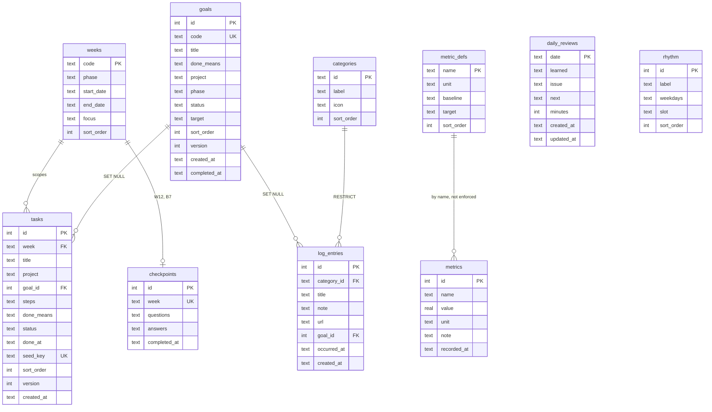

# Database design

SQLite, one file at `~/dashboard-data/dashboard.db`. **This document is the source
`migrations/001_init.sql` is transcribed from.** Schema changes start here, then become a
migration — never the other way round.

> **Table count delta.** `dashboard-plan-v2.md` describes six tables. This design has ten
> domain tables plus `schema_migrations`. The four additions (`weeks`, `rhythm`, `metric_defs`,
> `checkpoints`) hold seeded reference data that v2 listed as living in `seed.json` without
> saying where it lands at runtime: week windows and focus labels, the daily rhythm slots, the
> metric-name catalogue, and the checkpoint questions. Keeping them in tables means one access
> path for all data and one complete `GET /api/export`.

---

## 1. Conventions

| Convention | Rule |
|---|---|
| Primary keys | `INTEGER PRIMARY KEY` (rowid alias) except where a natural key is genuinely stable: `categories.id`, `metric_defs.name`, `daily_reviews.date`. |
| Human codes | `G0`…`G17` live in `goals.code`. They are **labels, not identity** — renumbering the master plan must never break a foreign key. |
| Timestamps | `TEXT`, RFC3339 UTC with a `Z` suffix: `2026-08-22T14:03:00Z`. Sorts correctly as a string, readable in any SQLite browser, marshals directly from Go's `time.Time`. |
| Dates | `TEXT`, `YYYY-MM-DD`. Always a **`Europe/Lisbon`** calendar date, not a UTC one. |
| Booleans | Not used. States are `TEXT` enums with `CHECK` constraints, so the value is self-describing in a raw query. |
| JSON columns | `TEXT` holding a JSON array. Used only for ordered lists that are always read and written whole (`tasks.steps`, `checkpoints.questions`, `checkpoints.answers`). Never queried into. |
| Optimistic locking | `goals` and `tasks` carry `version INTEGER NOT NULL DEFAULT 1`, incremented on every successful update. See §6. |
| PRAGMAs at open | `journal_mode=WAL`, `busy_timeout=5000`, `foreign_keys=ON`, `synchronous=NORMAL`. |

`foreign_keys=ON` must be set on **every** connection — SQLite defaults it off, and the
`ON DELETE SET NULL` rules below are silently inert without it.

---

## 2. ERD

---

## 3. Enumerations

Defined once here; every `CHECK` below references these sets.

| Enum | Values | Used by |
|---|---|---|
| `project` | `synapse` · `gateway` · `dash` · `oss` · `learn` · `write` · `career` · `all` | `goals.project`, `tasks.project` |
| `phase` | `P1` · `P2` · `P3` | `goals.phase`, `weeks.phase` |
| `goal_status` | `backlog` · `active` · `done` | `goals.status` |
| `task_status` | `todo` · `done` | `tasks.status` |
| `category id` | `application` · `module` · `portfolio` · `post` · `oss` · `number` · `network` · `exam` | `categories.id`, `log_entries.category_id` |

### Project normalisation

`master-plan-v5.md` writes project tags loosely. The seed generator normalises to exactly one
value per row:

| In the master plan | Stored |
|---|---|
| `[synapse]`, `[gateway]`, `[dash]`, `[oss]`, `[learn]`, `[write]`, `[career]` | as-is |
| `synapse (infra/)` | `synapse` |
| `all repos` | `all` |
| `synapse + gateway` (G11) | `synapse` |

**Known lossy case:** G11 is tagged for two projects and is stored under `synapse` alone, so it
will not appear when the Goals board is filtered to `gateway`. Accepted: a join table for one
row is not worth the query complexity. If a second multi-project row ever appears, revisit.

---

## 4. Tables

### 4.1 `schema_migrations`

Tracks which numbered migrations have been applied.

| Column | Type | Null | Default | Notes |
|---|---|---|---|---|
| `version` | INTEGER | no | — | PK. `1` for `001_init.sql`. |
| `applied_at` | TEXT | no | — | RFC3339 UTC. |

### 4.2 `weeks`

Seeded plan windows. Read-only at runtime.

| Column | Type | Null | Default | Notes |
|---|---|---|---|---|
| `code` | TEXT | no | — | PK. `W1`…`W12`, `B1`…`B7`. |
| `phase` | TEXT | no | — | `CHECK (phase IN ('P1','P2','P3'))`. |
| `start_date` | TEXT | no | — | `YYYY-MM-DD`, inclusive, Lisbon. |
| `end_date` | TEXT | no | — | `YYYY-MM-DD`, inclusive, Lisbon. |
| `focus` | TEXT | yes | NULL | The heading text after the em dash, e.g. `Golden set`. `B3`–`B6` have none. |
| `sort_order` | INTEGER | no | — | Chronological. |

`CHECK (start_date <= end_date)`. Windows must not overlap — enforced by the seed generator,
not by the schema.

### 4.3 `rhythm`

The operating-system table: which kind of work belongs to which weekday.

| Column | Type | Null | Default | Notes |
|---|---|---|---|---|
| `id` | INTEGER | no | — | PK. |
| `label` | TEXT | no | — | As written in the plan: `Mon`, `Tue–Wed`, `Sun`. |
| `weekdays` | TEXT | no | — | CSV of ISO weekday numbers, `1`=Mon … `7`=Sun. `Tue–Wed` → `2,3`. |
| `slot` | TEXT | no | — | `Theory: DDIA ~1 ch + 1 ByteByteGo case (1–2h)`. |
| `sort_order` | INTEGER | no | — | Mon-first. |

CSV rather than a row per day because the plan groups days (`Tue–Wed`) and the UI shows the
group's label. Lookup is `WHERE ',' || weekdays || ',' LIKE '%,' || ? || ',%'` — six rows, no
index needed.

### 4.4 `categories`

The eight quick-log buttons. Seeded, extensible by future migration.

| Column | Type | Null | Default | Notes |
|---|---|---|---|---|
| `id` | TEXT | no | — | PK, slug. `CHECK (id IN (…8 values…))`. |
| `label` | TEXT | no | — | `Application`, `Course module`, … |
| `icon` | TEXT | no | — | Emoji: `📮`, `📚`, … |
| `sort_order` | INTEGER | no | — | Order of the 4×2 grid on Today. |

The `CHECK` on a seeded slug is deliberate: it makes `log_entries.category_id` unambiguous and
turns a typo in the seed into a boot failure instead of an orphan category.

### 4.5 `metric_defs`

The metric-name catalogue, from the plan's Metrics targets table. Seeded reference data.

| Column | Type | Null | Default | Notes |
|---|---|---|---|---|
| `name` | TEXT | no | — | PK. `p95 latency (cached)`. |
| `unit` | TEXT | yes | NULL | `ms`, `%`, `€`. NULL when the plan gives none. |
| `baseline` | TEXT | yes | NULL | Free text as written: `>1s`, `—`. |
| `target` | TEXT | yes | NULL | Free text as written: `<0.8s`, `measurably ↓, CI-gated`. |
| `sort_order` | INTEGER | no | — | Plan order. |

`baseline` and `target` are TEXT, not REAL, because the plan states several of them as prose.
They are displayed beside the input, never computed with.

### 4.6 `goals`

| Column | Type | Null | Default | Notes |
|---|---|---|---|---|
| `id` | INTEGER | no | — | PK. |
| `code` | TEXT | yes | NULL | `UNIQUE`. `G0`…`G17` for seeded goals; NULL for hand-created ones. |
| `title` | TEXT | no | — | `CHECK (length(trim(title)) > 0)`. |
| `done_means` | TEXT | yes | NULL | The completion contract. Shown in the card detail sheet. |
| `project` | TEXT | no | — | `CHECK` against the `project` enum. |
| `phase` | TEXT | yes | NULL | `CHECK (phase IS NULL OR phase IN ('P1','P2','P3'))`. Derived by the generator from `target`. |
| `status` | TEXT | no | `'backlog'` | `CHECK (status IN ('backlog','active','done'))`. |
| `target` | TEXT | yes | NULL | Free text as written: `W8`, `P2-B1`, `Q2 2027`, `Aug 31`. |
| `sort_order` | INTEGER | no | `0` | Position within its status column. Sparse, steps of 100. |
| `version` | INTEGER | no | `1` | Bumped on every update. See §6. |
| `created_at` | TEXT | no | — | RFC3339 UTC. |
| `completed_at` | TEXT | yes | NULL | Stamped on entering `done`, cleared on leaving it. |

`CHECK (status = 'done' OR completed_at IS NULL)` — a goal cannot claim a completion time
while sitting in Backlog or Active.

All 18 seeded goals start as `backlog`. Nothing derives `active` from the target date: choosing
what is active is the accountability mechanism the board exists to force.

### 4.7 `tasks`

| Column | Type | Null | Default | Notes |
|---|---|---|---|---|
| `id` | INTEGER | no | — | PK. |
| `week` | TEXT | no | — | FK → `weeks(code)`, `ON DELETE RESTRICT`. |
| `title` | TEXT | no | — | `CHECK (length(trim(title)) > 0)`. |
| `project` | TEXT | no | — | `CHECK` against the `project` enum. |
| `goal_id` | INTEGER | yes | NULL | FK → `goals(id)`, **`ON DELETE SET NULL`**. |
| `steps` | TEXT | no | `'[]'` | JSON array of the numbered substeps. `[]` for hand-created tasks. |
| `done_means` | TEXT | yes | NULL | The `→ **Done =**` line. |
| `status` | TEXT | no | `'todo'` | `CHECK (status IN ('todo','done'))`. |
| `done_at` | TEXT | yes | NULL | RFC3339 UTC, stamped on toggle to `done`, cleared on untoggle. |
| `seed_key` | TEXT | yes | NULL | `UNIQUE`. `"<week>:<slug(title)>"` for seeded rows; NULL for hand-created ones. |
| `sort_order` | INTEGER | no | `0` | Order within the week, from the plan. |
| `version` | INTEGER | no | `1` | Bumped on every update. See §6. |
| `created_at` | TEXT | no | — | RFC3339 UTC. |

`CHECK (status = 'done' OR done_at IS NULL)`.

`steps` is a JSON array rather than a child table because it is always read and written whole,
never queried, never individually checkable in v1, and never referenced by anything else.

### 4.8 `log_entries`

The record of what actually happened. Append and delete only — never updated.

| Column | Type | Null | Default | Notes |
|---|---|---|---|---|
| `id` | INTEGER | no | — | PK. |
| `category_id` | TEXT | no | — | FK → `categories(id)`, **`ON DELETE RESTRICT`**. |
| `title` | TEXT | no | — | `CHECK (length(trim(title)) > 0)`. |
| `note` | TEXT | yes | NULL | Free text. |
| `url` | TEXT | yes | NULL | The quick-log sheet has one input; the client routes it here when it parses as `http(s)://…`, otherwise into `note`. |
| `goal_id` | INTEGER | yes | NULL | FK → `goals(id)`, **`ON DELETE SET NULL`**. Feeds the "proof of motion" count. |
| `occurred_at` | TEXT | no | — | RFC3339 UTC. Defaults to now; backdatable from the sheet. |
| `created_at` | TEXT | no | — | RFC3339 UTC. Differs from `occurred_at` on a backdated entry. |

`RESTRICT` on the category is intentional: categories are seeded and must never be deleted out
from under history.

### 4.9 `daily_reviews`

| Column | Type | Null | Default | Notes |
|---|---|---|---|---|
| `date` | TEXT | no | — | PK, `YYYY-MM-DD`, Lisbon. The upsert key. |
| `learned` | TEXT | yes | NULL | Bullet 1. |
| `issue` | TEXT | yes | NULL | Bullet 2. |
| `next` | TEXT | yes | NULL | Bullet 3. |
| `minutes` | INTEGER | yes | NULL | Optional time spent. `CHECK (minutes IS NULL OR minutes >= 0)`. |
| `created_at` | TEXT | no | — | RFC3339 UTC. |
| `updated_at` | TEXT | no | — | RFC3339 UTC. Rewritten on every upsert. |

`CHECK (coalesce(learned,'') || coalesce(issue,'') || coalesce(next,'') <> '')` — an entirely
empty review must not count toward the streak, so it must not exist.

### 4.10 `metrics`

Free-form time series. One row per reading.

| Column | Type | Null | Default | Notes |
|---|---|---|---|---|
| `id` | INTEGER | no | — | PK. |
| `name` | TEXT | no | — | Usually a `metric_defs.name`, but **not** a foreign key — the Review screen's "other…" field must accept a new name without a migration. |
| `value` | REAL | no | — | |
| `unit` | TEXT | yes | NULL | Falls back to `metric_defs.unit` for display. |
| `note` | TEXT | yes | NULL | |
| `recorded_at` | TEXT | no | — | RFC3339 UTC. |

The deliberate absence of a foreign key is the reason the UI leads with a picker: consistent
spelling is enforced by the interface, not the schema, because the escape hatch matters more.

### 4.11 `checkpoints`

The five-question checkpoint review, at W12 and B7.

| Column | Type | Null | Default | Notes |
|---|---|---|---|---|
| `id` | INTEGER | no | — | PK. |
| `week` | TEXT | no | — | `UNIQUE`. FK → `weeks(code)`, `ON DELETE RESTRICT`. `W12`, `B7`. |
| `questions` | TEXT | no | — | JSON array of 5 strings, seeded. |
| `answers` | TEXT | yes | NULL | JSON array, index-aligned with `questions`. |
| `completed_at` | TEXT | yes | NULL | RFC3339 UTC, stamped when answers are first saved. |

---

## 5. Indexes

Every index exists for one named query. There are no speculative indexes — this database will
hold a few thousand rows.

| Index | Serves |
|---|---|
| `idx_log_entries_occurred_at` on `log_entries(occurred_at DESC)` | `GET /api/logs` — the reverse-chronological feed and its cursor pagination. |
| `idx_log_entries_category_occurred` on `log_entries(category_id, occurred_at DESC)` | `GET /api/logs?category=…` and `GET /api/logs/summary` — per-category counters. |
| `idx_log_entries_goal_id` on `log_entries(goal_id)` | The linked-log count chip on every Kanban card. |
| `idx_tasks_week` on `tasks(week, sort_order)` | `GET /api/tasks?week=W5` and the dashboard bundle's week checklist. |
| `idx_goals_status_sort` on `goals(status, sort_order)` | `GET /api/goals` grouped into the three Kanban columns, in column order. |
| `idx_metrics_name_recorded` on `metrics(name, recorded_at DESC)` | The Review screen's "last few readings" for the selected metric. |

`UNIQUE` constraints on `goals.code`, `tasks.seed_key`, and `checkpoints.week` create their own
indexes; they exist for correctness (§7) and are used for lookup by the seed loader.

---

## 6. Optimistic concurrency

`goals` and `tasks` are the only mutable-by-editing resources, and the only ones with a
`version` column.

- Every update is `UPDATE … SET …, version = version + 1 WHERE id = ? AND version = ?`.
- Zero rows affected → the store returns `ErrConflict` → the API responds `412`.
- `log_entries` (append/delete only), `daily_reviews` (upsert by date, last write wins by
  design), and `metrics` (append only) have no version column and need none.

This protects exactly one scenario: the phone and the laptop both open on the same screen. It
is cheap plumbing for a real, if rare, case.

---

## 7. Migration policy

- Numbered SQL files in `migrations/`: `001_init.sql`, `002_….sql`, …
- Embedded with `go:embed` and applied at boot, **each inside its own transaction**.
- **Forward-only.** No down migrations — the recovery path is a backup file.
- Applied versions are recorded in `schema_migrations`; the runner applies only versions
  greater than the current maximum, so running it twice is a no-op.
- A migration that fails aborts startup with a non-zero exit. No partial schema.
- `001_init.sql` is a 1:1 transcription of §4 and §5. If they disagree, this document is right
  and the SQL is a bug.

---

## 8. Seed policy

The seed is `internal/seed/seed.json`, generated from `master-plan-v5.md` by `cmd/seedgen`
(`make seed-gen`) and **committed**. The server never reads the markdown — a parser bug can
therefore never prevent a boot.

The loader runs at boot, after migrations, and is **additive upsert**:

| Table | Match key | On match |
|---|---|---|
| `weeks` | `code` | leave untouched |
| `rhythm` | `label` | leave untouched |
| `categories` | `id` | leave untouched |
| `metric_defs` | `name` | leave untouched |
| `goals` | `code` | leave untouched |
| `tasks` | `seed_key` | leave untouched |
| `checkpoints` | `week` | leave untouched |

**Insert only. Never UPDATE, never DELETE.** A row that already exists keeps its `status`,
`done_at`, `completed_at`, `sort_order`, and any edits. Rows with `code`/`seed_key` NULL — the
goals and tasks you create in the app — are invisible to the loader and can never be touched
by it.

Consequences, both accepted:

- Adding a task to the master plan, regenerating, and restarting **does** make it appear.
- Editing an existing task's **title** in the master plan makes it appear as a **new** task,
  because the title is part of `seed_key`. The old one remains. Edit titles knowingly, or
  delete the stale row in the app.

This replaces v2's "load only when `goals` is empty" rule, which could never pick up a plan
amendment without destroying real progress.

---

## 9. Backup and export

- Nightly ticker: `VACUUM INTO 'backups/dashboard-YYYYMMDD.db'`. Atomic and consistent by
  construction — a plain file copy of a WAL database can capture a torn state. Output is a
  compact database that opens directly.
- Newest 14 retained; older pruned.
- `GET /api/export` dumps every table in §4 as one JSON document, on demand.
- Restore is manual and out of scope for v1: stop the server, replace the file, start it.
